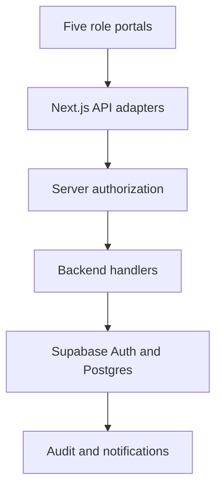

# Smart Campus Room Management System

A college hackathon project with five portals and a fixed timetable plus one-time overrides.

## Current build: Phase 1

Next.js 14 App Router, TypeScript, Tailwind, shadcn-style Button, Supabase Auth/database setup, Framer Motion and a lazy React Three Fiber campus hero. Five role login selections, server authorization, roll-number mapping, department confirmation, SQL schema/RLS and a 650-room sample generator are implemented. The first Phase 2 slice adds a date/time classroom finder backed by one tested availability module. Timetable editing, approvals and later workflows are not complete. See docs/PHASE_PROGRESS.md.

Frontend: frontend/app and frontend/components. API route adapters delegate to backend/. Shared typed modules live in lib/. SQL and seeds live in db/.



## Local setup

1. Install Node.js 20 or later and run npm ci.
2. Copy .env.example to frontend/.env.local.
3. For the local demo, set NEXT_PUBLIC_DEMO=true and a random DEMO_SESSION_SECRET of at least 32 characters. Generate one with `node -e "console.log(require('crypto').randomBytes(32).toString('hex'))"`.
4. Run npm run dev and open http://localhost:3000.
5. Select a portal and use Open demo. No real student records are connected.

For live authentication, disable demo mode, configure Supabase environment variables, run db/schema.sql and db/rls.sql in a new project, and seed using an explicitly provided development password. The seed runs from repository root, so supply its environment variables in your terminal; it does not load frontend/.env.local automatically.

```bash
npm run seed
npm run typecheck
npm run lint
npm run test
npm run build
```

Database integration has not been verified against a real Supabase project. Do not seed sample accounts in production.

## Fixed timetable and availability design

The official weekly timetable stays intact. A cancellation or room change affects one occurrence/date, stored separately. The room_occupancy view combines effective classes, makeups, approved clubs and maintenance. Later phases will use one TypeScript availability function and transactionally reserve rooms; those workflows are not implemented yet.

## Deployment

See docs/DEPLOYMENT.md. This rebuild has not been deployed to Vercel. The earlier hosted sample preview is a separate prototype and does not show this Next.js build.

Next.js 14 was explicitly requested, but the dependency audit identifies known vulnerabilities. Read SECURITY.md before production deployment.

## Process

The supplied requirements are saved in docs/BUILD_SPECIFICATION.md, with persistent rules in AGENTS.md. GitHub history records feature commits. The earlier Python prototype is retained in backend/server.py and the static preview in frontend/preview; neither powers the current Next.js app.
